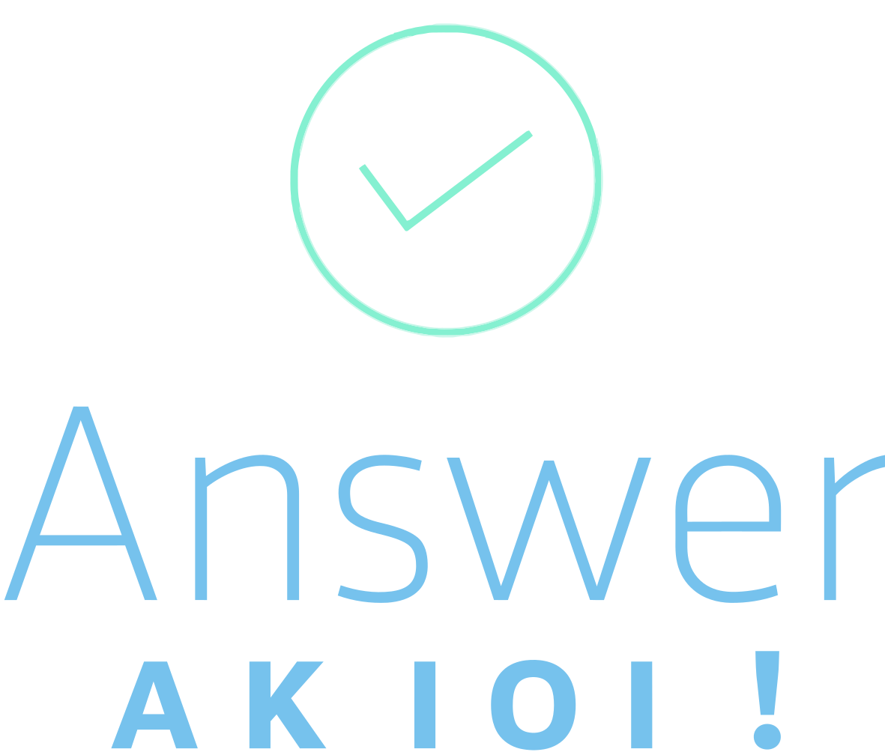

---

    

---

> 声明：本自述文件使用 CC BY-NC-SA 4.0
> 协议。您可以在 [此页面](https://creativecommons.org/licenses/by-nc-sa/4.0/deed.zh-Hans) 找到协议的详细描述文件。

> Disclaimer: This Readme uses the CC BY-NC-SA 4.0 protocol. You can find a detailed description of the protocol
> on [this page](https://creativecommons.org/licenses/by-nc-sa/4.0/deed.en).

> 免責事項：このReadmeは、CC BY-NC-SA 4.0プロトコルを使用しています。
> プロトコルの詳しい説明は、[このページ](https://creativecommons.org/licenses/by-nc-sa/4.0/deed.ja)にあります。

> Отказ от ответственности: В этом Readme используется протокол CC BY-NC-SA 4.0. Подробное описание протокола можно
> найти на [этой странице](https://creativecommons.org/licenses/by-nc-sa/4.0/deed.be).

---

中文 | [English](./Readme-EN.md)

# 这个仓库是[洛谷](https://www.luogu.com.cn)的主题库与少量私人题库的题解。

因为目前本人仍在役，所以注定了绝大多数代码都是 `C++` 的。

添加这个 REPO 主要是因为我的历史代码管理极其差，遂用 Git 与 Github 来托管。
但后期发现这是一个可以造福广大 OIer 与算法练习的地方，且我的做法与很多人不同，故将其 Public 与添加 ReadMe。

当我在写这些的时候，发现版权声明居然貌似比正文长。

BY: limingrui0